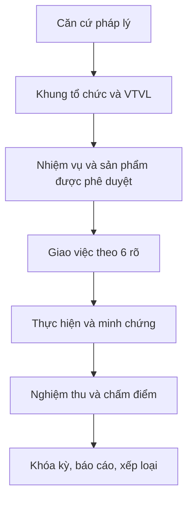

# ĐẶC TẢ CHUYÊN SÂU MODULE KPI - CẬP NHẬT THEO HỒ SƠ VTVL VÀ PHÂN CÔNG

## 1. Mục tiêu cập nhật

Module KPI phải là hệ thống theo dõi và đánh giá kết quả thực hiện nhiệm vụ gắn với vị trí việc làm, sản phẩm đầu ra, trách nhiệm và căn cứ đã phê duyệt. Phần bổ sung này mở rộng đặc tả workflow trước đây bằng lớp dữ liệu VTVL, khung năng lực, phân công lãnh đạo và kiểm soát hồ sơ.

Nguồn pháp lý/nghiệp vụ chi tiết được lập tại `KPI_LEGAL_BASIS.md`.

## 2. Mô hình nghiệp vụ chuẩn



### 2.1. Chuỗi liên kết bắt buộc

`Căn cứ -> Cơ cấu -> VTVL -> Người dùng -> Nhiệm vụ/sản phẩm -> Giao việc -> Minh chứng -> Nghiệm thu -> Thành phần điểm -> Kết quả kỳ -> Kết quả năm`.

Không tạo kết quả KPI độc lập với chuỗi liên kết trên.

### 2.2. Bốn loại chủ thể

| Loại | Cách đánh giá | Dữ liệu nguồn |
|---|---|---|
| Lãnh đạo/quản lý | Kết quả nhiệm vụ cá nhân và kết quả chỉ đạo/điều hành | VTVL 1A, khung 2A, danh mục QL |
| Chuyên môn/nghiệp vụ | Sản phẩm/công việc theo VTVL, số lượng, chất lượng, tiến độ | VTVL 1B, khung 2B, danh mục DC/phòng |
| Hỗ trợ/phục vụ | Công việc phục vụ, chất lượng, tuân thủ quy trình, hiệu quả | VTVL 1C và tiêu chí được phê duyệt |
| Người lao động hợp đồng | Áp dụng theo quyết định/quy chế của xã nếu được quyết định | Căn cứ nội bộ và mô tả công việc |

## 3. Module Master Data

### 3.1. Căn cứ pháp lý

Trường tối thiểu: `code`, `title`, `number`, `issued_date`, `issuer`, `document_type`, `file_url`, `effective_from`, `effective_to`, `status`, `scope`, `article_reference`, `parent_document_id`, `verification_status`.

Trạng thái: `DRAFT`, `UNDER_REVIEW`, `APPROVED`, `EXPIRED`, `REPLACED`, `ARCHIVED`.

### 3.2. VTVL

Trường tối thiểu: `position_code`, `position_name`, `position_group`, `objective`, `effective_from`, `effective_to`, `approval_document_id`, `direct_manager_role`, `approval_role`.

Các bảng con:

- `position_duties`: mảng nhiệm vụ, công việc cụ thể, sản phẩm đầu ra, tiêu chí hoàn thành.
- `position_authorities`: phạm vi quyền hạn.
- `position_relationships`: quản lý trực tiếp, phối hợp nội bộ, phối hợp bên ngoài.
- `position_competencies`: năng lực, nhóm năng lực, cấp độ yêu cầu 1-5.
- `user_position_assignments`: người dùng, VTVL, đơn vị, thời gian hiệu lực.

Không cho giao việc nếu VTVL của người nhận đã hết hiệu lực hoặc không thuộc đơn vị/phạm vi được giao, trừ quyền ADMIN có lý do và audit.

### 3.3. Khung năng lực

Danh mục mặc định:

- Năng lực chung: đạo đức và bản lĩnh; tổ chức thực hiện công việc; soạn thảo và ban hành văn bản; giao tiếp ứng xử; quan hệ phối hợp; công nghệ thông tin; ngoại ngữ.
- Năng lực chuyên môn: tham mưu xây dựng; hướng dẫn thực hiện; kiểm tra; thẩm định/góp ý; tổ chức thực hiện văn bản.
- Năng lực quản lý: tư duy chiến lược; quản lý sự thay đổi; ra quyết định; quản lý nguồn lực; phát triển đội ngũ.

Mỗi năng lực có mô tả hành vi cấp 1-5. Dashboard năng lực chỉ phục vụ đối chiếu yêu cầu VTVL, đánh giá nhu cầu bồi dưỡng và quản trị nhân sự; chỉ tính vào điểm khi có tiêu chí/căn cứ phê duyệt.

### 3.4. Danh mục sản phẩm/công việc

Trường tối thiểu: `code`, `name`, `description`, `output_type`, `unit`, `position_group`, `position_ids`, `department_id`, `complexity_group`, `score_range`, `score`, `standard_product_id`, `coefficient`, `legal_basis_id`, `version`, `status`.

Phải nạp và giữ nguyên mã danh mục hiện hành như `QL.*`, `DC.*`, `VP.*`, `KT.*`, `ĐC.*` nếu có trong workbook. Không tự đổi mã khi import; nếu trùng mã phải tạo hàng đợi xử lý.

## 4. Luồng giao việc và kiểm soát trách nhiệm

### 4.1. Trường bắt buộc

`period_id`, `task_code`, `task_name`, `assigner_id`, `primary_owner_id`, `coordinating_users`, `lead_department_id`, `quantity_assigned`, `unit`, `deadline`, `expected_output`, `complexity_group`, `coefficient_snapshot`, `legal_basis_snapshot`, `risk_level`.

### 4.2. Kiểm tra trước khi giao

1. Người nhận có VTVL phù hợp.
2. Nhiệm vụ thuộc danh mục đã phê duyệt hoặc được đánh dấu phát sinh.
3. Có một và chỉ một người phụ trách chính.
4. Có đơn vị đầu mối và người kiểm tra/nghiệm thu.
5. Deadline thuộc kỳ hoặc có phân bổ kỳ rõ ràng.
6. Nhiệm vụ nhạy cảm có cờ rủi ro và đường phê duyệt tương ứng.

### 4.3. Giao việc phát sinh

Cho phép tạo việc phát sinh nhưng bắt buộc có: lý do, người đề xuất, người duyệt, sản phẩm đầu ra, điểm/nhóm tạm tính, căn cứ giao việc và thời hạn. Việc phát sinh chỉ được đưa vào tính điểm sau khi được phê duyệt theo quy chế của xã. Nếu lặp lại, hệ thống đề xuất đưa vào danh mục chính thức.

## 5. KPI Engine

### 5.1. Snapshot dữ liệu

Khi giao việc, lưu snapshot của tên nhiệm vụ, điểm chấm, hệ số, nhóm, căn cứ và phiên bản công thức. Kết quả kỳ dùng snapshot, không đọc lại master data hiện tại để tính hồi tố.

### 5.2. Thành phần kết quả

| Thành phần | Nội dung | Quy tắc |
|---|---|---|
| Số lượng | Khối lượng hoàn thành quy đổi so với giao | Có thể vượt 100% nhưng phải có trần cấu hình theo căn cứ |
| Chất lượng | Sản phẩm đạt yêu cầu sau nghiệm thu | Chỉ trừ do lỗi được xác nhận, không tự động trừ vì mọi lần yêu cầu bổ sung |
| Tiến độ | Hoàn thành so với hạn/phân bổ kỳ | Cho phép cấu hình cách tính; không hard-code mức phạt chưa được phê duyệt |
| Tiêu chí chung | 30 điểm theo QĐ 283/biểu mẫu áp dụng | Tách khỏi kết quả sản phẩm |
| Quản lý | Kết quả chỉ đạo, điều phối, kiểm tra, phát triển đội ngũ nếu được phê duyệt | Không tạo biến d/đ/e khi chưa có định nghĩa và căn cứ |

Công thức khối lượng quy đổi:

```text
assigned_converted = sum(assigned_quantity * coefficient_snapshot)
completed_converted = sum(accepted_quantity * coefficient_snapshot)
quality_converted = sum(accepted_quantity * coefficient_snapshot * max(0, 1 - reworks * 0.25))
on_time_converted = sum(accepted_quantity * coefficient_snapshot * max(0, 1 - delays * 0.25))
```

### 5.2.1. Phương thức tính chính thức theo Nghị định 335 (`ND335_OFFICIAL_ABC` - `LEGAL_MANDATORY`):
- **Thành tố a (Số lượng)**: $a = \min(1.0, \frac{\text{completed\_converted}}{\text{assigned\_converted}})$
- **Thành tố b (Chất lượng)**: $b = \max(0.0, \min(1.0, \frac{\text{quality\_converted}}{\text{assigned\_converted}}))$ (Miễn trừ khi có cờ `is_exempted_rework`).
- **Thành tố c (Tiến độ)**: $c = \max(0.0, \min(1.0, \frac{\text{on\_time\_converted}}{\text{assigned\_converted}}))$ (Miễn trừ khi có cờ `is_exempted_delay`).
- **Điểm Phần II (Kết quả nhiệm vụ)**:
  - Công chức chuyên môn: $\text{TaskScore} = \min(70, \frac{a + b + c}{3} \times \text{taskSectionMax})$
  - Công chức lãnh đạo: $\text{TaskScore} = \min(70, \frac{a + b + c + d + đ + e}{6} \times \text{taskSectionMax})$
- **Điểm Tổng kết quả**: $\text{TotalScore} = \text{CommonCriteriaScore (Phần I - Max 30)} + \text{TaskScore (Phần II - Max 70)}$.

### 5.2.2. Phương thức tích lũy điểm chi tiết (`WEIGHTED_DETAIL_SCORE` - `LOCAL_POLICY_PROPOSAL` / `LEGAL_REVIEW_REQUIRED`):
- Tích lũy điểm trực tiếp: $\text{TaskScore} = \min(70, \sum(\text{accepted\_quantity} \times \text{baseline} \times \text{coefficient} \times \text{quality} \times \text{progress}))$.
- Chỉ kích hoạt khi có Quyết định/Quy chế của UBND xã phê duyệt phương thức tính điểm trực tiếp theo từng sản phẩm. Gắn cờ cảnh báo `LEGAL_REVIEW_REQUIRED`.

### 5.3. Nhiệm vụ chuyển giao và nhiều người

- Người A vẫn có lịch sử nhiệm vụ; khi chuyển giao, hệ thống ghi thời điểm, lý do, người duyệt và khối lượng A đã thực hiện.
- Không mặc định đưa điểm A về 0 nếu A đã hoàn thành phần việc được nghiệm thu; phần chưa thực hiện chuyển cho B.
- B được ghi nhận là người nhận thêm; khối lượng và điểm của B theo phần được giao/được nghiệm thu.
- Nhiệm vụ nhóm phải có tổng tỷ trọng tham gia bằng 100% và người phụ trách chính.
- Nhiệm vụ kéo dài phải có phân bổ tháng/tuần; tổng tỷ trọng phân bổ không vượt 100%.

## 6. Quy trình trạng thái

`DRAFT -> ASSIGNED -> ACCEPTED -> IN_PROGRESS -> SUBMITTED -> NEEDS_REVISION/ACCEPTED -> APPROVED -> LOCKED`.

Mọi chuyển trạng thái lưu `actor`, `timestamp`, `reason`, `old_value`, `new_value`, `evidence_ids`. `LOCKED` chỉ mở lại bằng quyền được cấu hình, lý do bắt buộc và audit.

## 7. Mô hình dữ liệu bổ sung

Nếu hệ thống đã có bảng tương đương thì lập mapping, không tạo bản sao:

- `legal_documents`, `legal_document_versions`.
- `organizational_units`, `positions`, `position_duties`, `position_competencies`, `user_position_assignments`.
- `work_catalog_items`, `work_catalog_versions`, `standard_products`, `conversion_coefficients`.
- `evaluation_periods`, `task_assignments`, `task_coordinators`, `task_evidences`, `task_progress_logs`.
- `task_reviews`, `task_transfers`, `task_group_members`, `task_period_allocations`.
- `kpi_formula_versions`, `kpi_score_components`, `kpi_period_results`, `kpi_year_results`.
- `approval_flows`, `approval_actions`, `audit_logs`.

## 8. API và màn hình phải bổ sung

### API

- `GET/POST/PUT /api/legal-documents`
- `GET/POST/PUT /api/positions`, `/api/positions/:id/duties`, `/api/positions/:id/competencies`
- `GET/POST/PUT /api/competencies`, `/api/competency-levels`
- `GET/POST/PUT /api/work-catalog`, `/api/work-catalog/import`, `/api/work-catalog/versions`
- `GET/POST/PUT /api/conversion-coefficients`, `/api/standard-products`
- `GET/POST/PUT /api/evaluation-periods`, `/api/evaluation-periods/:id/lock`, `/unlock`
- `POST /api/tasks/:id/transfer`, `/split`, `/allocate`, `/submit`, `/request-revision`, `/approve`
- `GET /api/kpi/results/:userId`, `/unit/:unitId`, `/period/:periodId`, `/year/:year`
- `GET /api/audit-logs?entityType=&entityId=&periodId=`

### Màn hình

1. Kho căn cứ pháp lý và phiên bản.
2. Cơ cấu tổ chức, VTVL và người giữ VTVL.
3. Khung năng lực và mức yêu cầu.
4. Danh mục sản phẩm/công việc, sản phẩm chuẩn, hệ số.
5. Giao việc theo 6 rõ và cờ rủi ro.
6. Nhiệm vụ của tôi, cập nhật tiến độ, nộp minh chứng.
7. Thẩm định/nghiệm thu/phê duyệt.
8. Kỳ đánh giá, tự đánh giá tiêu chí chung, khóa/mở khóa.
9. Dashboard cá nhân, đơn vị, lãnh đạo và toàn xã.
10. Báo cáo đối chiếu và audit log.

## 9. Tiêu chí nghiệm thu bổ sung

- Import đúng danh mục QĐ 283, giữ mã, nhóm, điểm, hệ số và ghi chú.
- Hiển thị được chuỗi VTVL -> nhiệm vụ -> sản phẩm -> người phụ trách.
- Cảnh báo giao việc sai VTVL, thiếu người phụ trách chính, thiếu sản phẩm hoặc thiếu deadline.
- Tách được 30 điểm tiêu chí chung và phần kết quả nhiệm vụ; không cộng trùng.
- Tính đúng hệ số theo snapshot sản phẩm chuẩn và không hồi tố sau khóa kỳ.
- Nhiệm vụ chuyển giao, nhiệm vụ nhóm và nhiệm vụ kéo dài có lịch sử, tỷ trọng và điểm riêng.
- Người có quyền có thể xem vì sao một điểm được tạo ra: nhiệm vụ, minh chứng, người nghiệm thu, công thức, căn cứ.
- Khóa kỳ ngăn mọi thay đổi nghiệp vụ; mở khóa phải có quyền, lý do và audit.
- Báo cáo thể hiện người phụ trách chính, phối hợp, đơn vị đầu mối, VTVL, năng lực liên quan và căn cứ.

## 10. Giai đoạn triển khai

1. Pháp lý và master data: kho căn cứ, cơ cấu, VTVL, năng lực, import danh mục.
2. Workflow: giao việc, phát sinh, minh chứng, nghiệm thu, chuyển giao, phân bổ.
3. KPI Engine: snapshot, công thức phiên bản, tiêu chí chung, kết quả kỳ/năm.
4. Điều hành: liên kết tài chính, đầu tư công, đất đai/KH965, TTHC, văn phòng và giao ban.
5. Báo cáo, audit, khóa kỳ, kiểm thử và chạy thử có đối chiếu hồ sơ giấy.

Không triển khai bước sau khi bước trước chưa có dữ liệu chuẩn, thẩm quyền và tiêu chí nghiệm thu được xác nhận.
